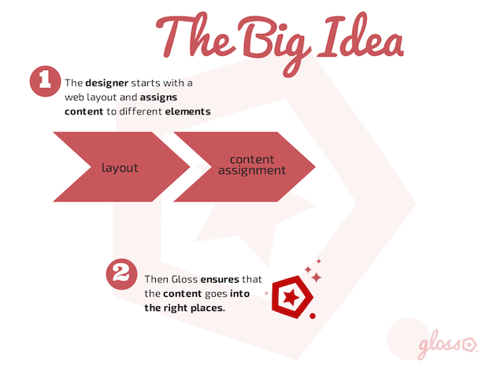
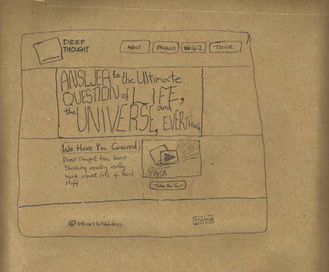
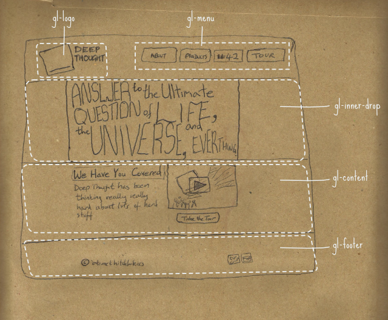

.. Gloss Project documentation master file, created by
   sphinx-quickstart on Tue Nov 11 20:07:01 2014.
   You can adapt this file completely to your liking, but it should at least
   contain the root `toctree` directive.

.. image:: gloss-logo-medium.png

The Gloss Project
=========================================

Gloss is a new web design process, primarily aimed at creating happy design teams. 
If you're interested in building content driven sites in less time, Gloss may be a
good fit. If you have an opinionated team that think they've figured it all out then
there's nothing to see here, just move on.

Show me the Docs
------------------
If you want to dive straight into the documentation follow the link below:

 :ref:`Documentation </documentation>`

Gloss in a Nutshell
---------------------

Gloss relies on a technique called "Content Assignment", this makes it possible for a designer to 
assign headers, footers, menus and other components to elements of a template, simply by assigning special
classes to elements of their template.


The Process
--------------------------------

The general day to day workflow roughly looks like this:




1. Layout and Content Assignment
````````````````````````````````

Start with an html layout, we'll assume that you spent time on each pixel and css rule to handcraft the most
beautiful, preferably responsive, layout. Or you use a tool that produces well structured html code (preferably responsive).



To your code you add the special Gloss class (we call them gl classes).



2. Publish
````````````````````````````````

Then you publish or upload your changes.

As much as possible Gloss does the rest for you. We're working to ensure that Gloss allows you to stay focused
on visual and interaction design. To this end we will introduce new features based on feedback that make
this increasingly possible.
