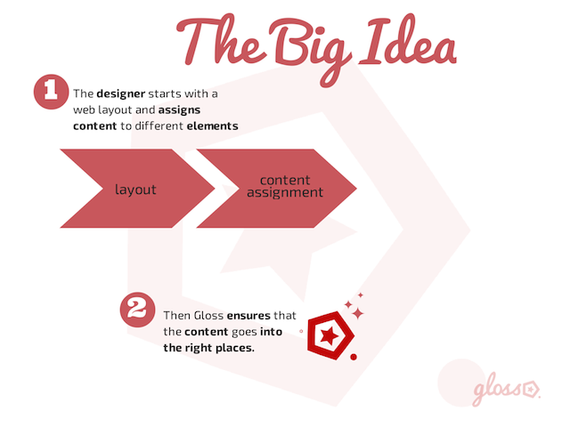
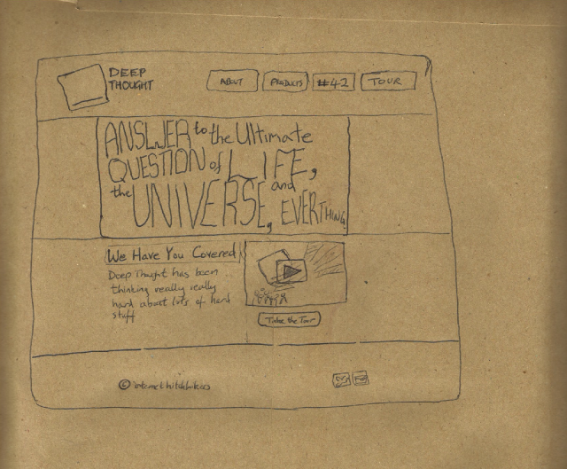

.. Gloss Project documentation master file, created by
   sphinx-quickstart on Tue Nov 11 20:07:01 2014.
   You can adapt this file completely to your liking, but it should at least
   contain the root `toctree` directive.

.. image:: gloss-logo-medium.png

Gloss in a Nutshell
=========================================

Gloss relies on a technique called "Content Assignment", this makes it possible for a designer to 
assign headers, footers, menus and other components to elements of a template, simply by assigning special
classes to elements of their template.


The Process
--------------------------------

The general day to day workflow roughly looks like this:




1. Layout and Content Assignment
````````````````````````````````

Start with an html layout, we'll assume that you spent time on each pixel and css rule to handcraft the most
beautiful, well-formed, and preferably responsive, layout.



To your html layout you then add special Gloss classes (specifically these are CSS classes prefixed with gl-).

.. image:: gloss-site-with-gloss-classes.png

2. Publish
````````````````````````````````

Then you publish or upload your changes.

As much as possible, Gloss does the rest for you. 
